# Scientific_literature_assistant (Ассистент для работы с научной литературой)
# О репозитории
Репозиторий содержит файл app.py, содержащий код приложения, README.md и requirements.txt (для установки всех требуемых библиотек)
# О приложение
Это Web-приложение позволяет пользователям загружать файлы различного формата(pdf, doc, txt) и работать с ними благодаря различному функционалу. Цель проекта — упростить процесс работы с научной литературой.
# Используемые технологии
- [Документация streamlit](https://docs.streamlit.io/)
- [Документация PyMuPDF](https://pymupdf.readthedocs.io/en/latest/)
- [Документация GigaChat API](https://developers.sber.ru/docs/ru/gigachat/api/overview)
- [Документация GigaChain](https://developers.sber.ru/docs/ru/gigachain/overview)
- [Документация LangChain](https://python.langchain.com/docs/introduction/)
- [Документация HuggingFace](https://huggingface.co/docs)
- [Документация FAISS](https://faiss.ai/)

# Начало работы
Ниже приведена инструкция по началу работы. Чтобы получить локальную копию и запустить её, выполните следующие простые шаги.
## Установка
**1. Клонируйте репозиторий:**
   ```bash
   git clone https://github.com/Aptukov/Scientific_literature_assistant
   ```
**2. Установите необходимые пакеты:**
   ```bash
   pip install -r requirements.txt
   ```
## Использование (В качестве примера используется статья на английском)
### 1. Запустите приложение через терминал:
   ```bash
   streamlit run app.py
   ```
   Перед вами появится окно приложения.
   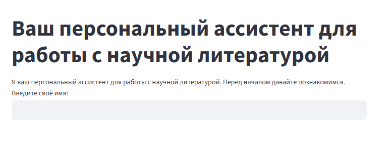
   
### 2. Введите своё имя в соответственное поле.

### 3. После ввода имени перед вами появится приветственное сообщение и инструкция по работе с ассистентом.
   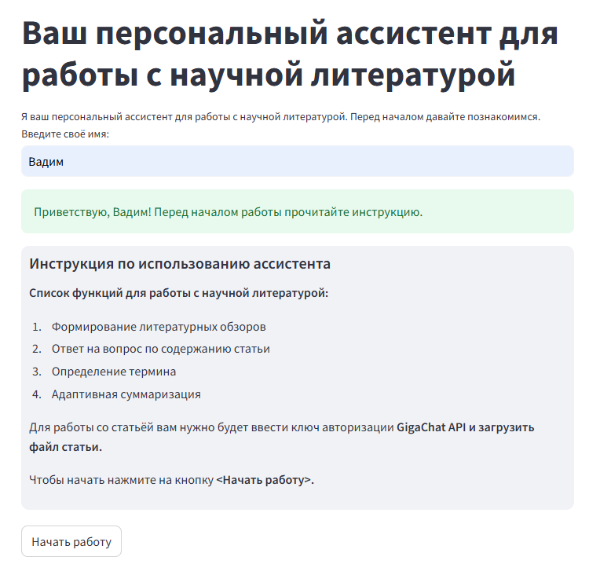

### 4. Нажмите на кнопку "Начать работу"
   После нажатия кнопки страница обновится и появятся поля для ввода ключа авторизации и загрузки файла.
   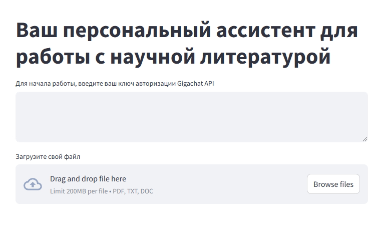
   
### 4. Введите свой ключ авторизации GigaChat API.
   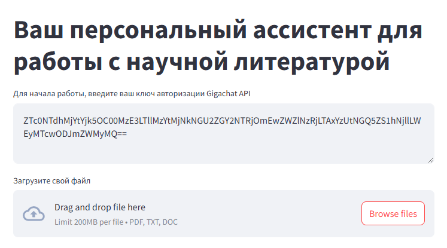
   
### 3. Загрузите файл статьи через интерфейс.
   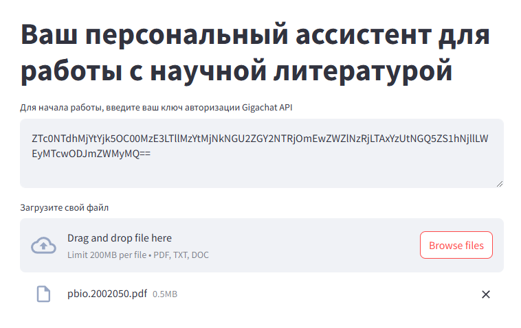
   
### 4. Выбери одну из предложенных функций, чтобы начать работу со статьёй.
   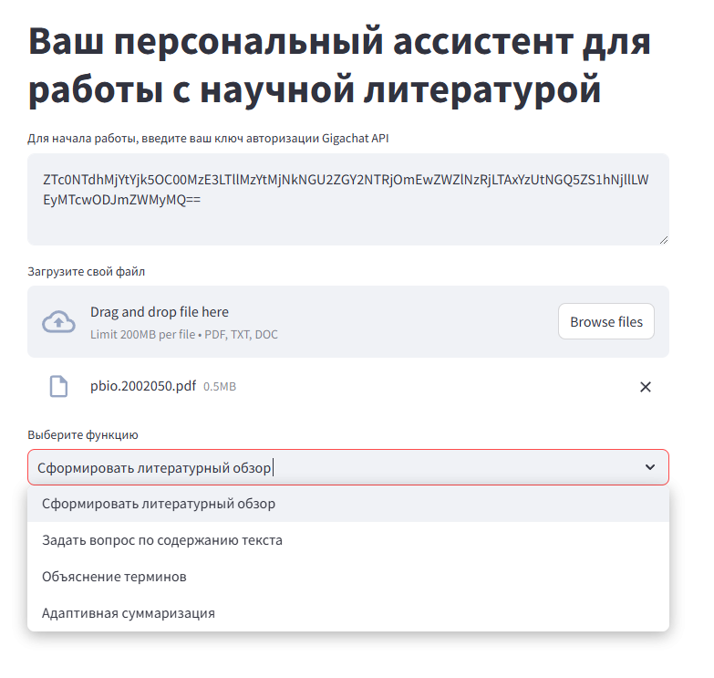
   
   #### 1) Формирование литературных обзоров
   Нажмите на кнопку "Сформировать литературный обзор", после чего выведется литературный обзор статьи.
   
   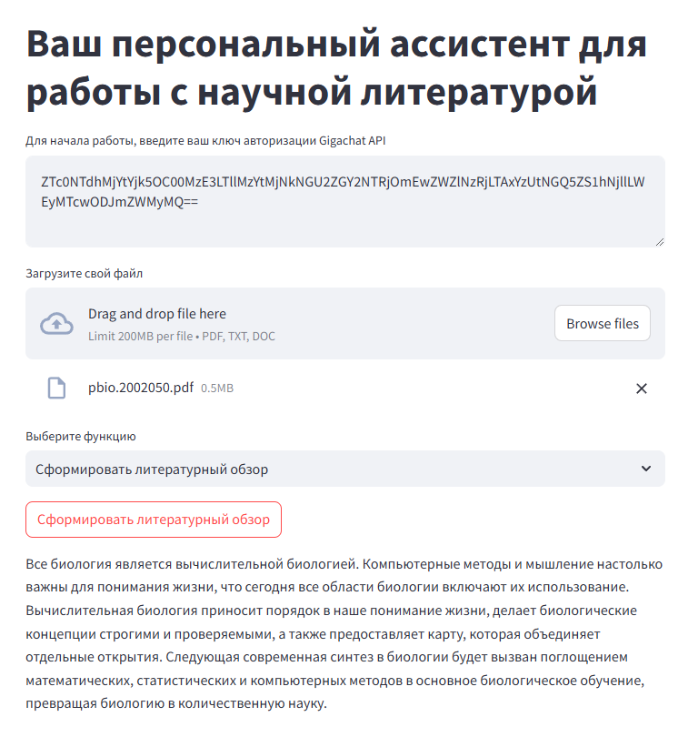
   #### 2) Ответ на вопрос по содержанию статьи
   Напишите свой вопрос в соотвутствующее поле и нажмите кнопку "Задать вопрос", после чего ассистент выдаст ответ, исходя из содержания статьи.
   
   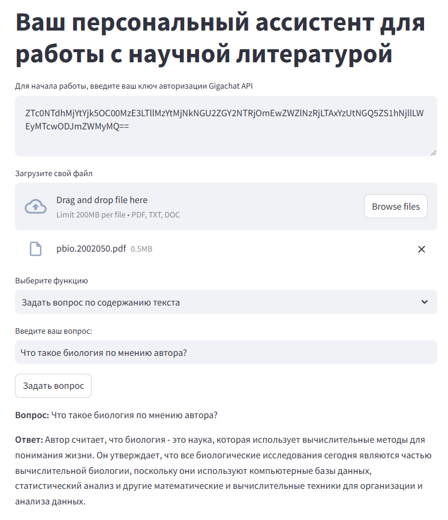
   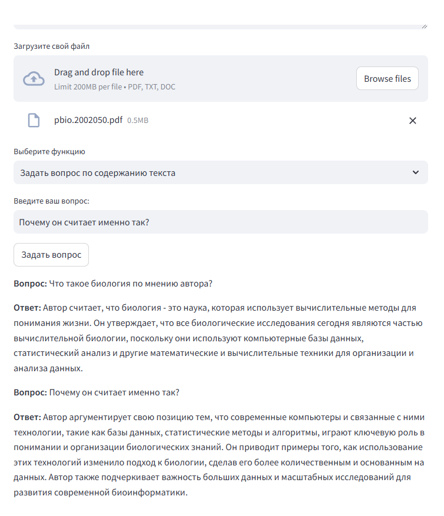
      
   #### 3) Определение термина
   Напишите термин, определение которого хотите узнать, затем нажмите кнопку "Объяснить термин" и ассистент выдаст определение на основе текста статьи.
   
   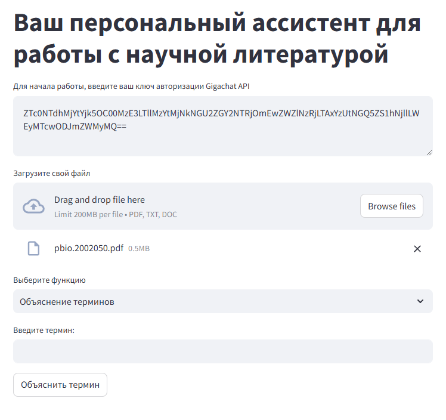
   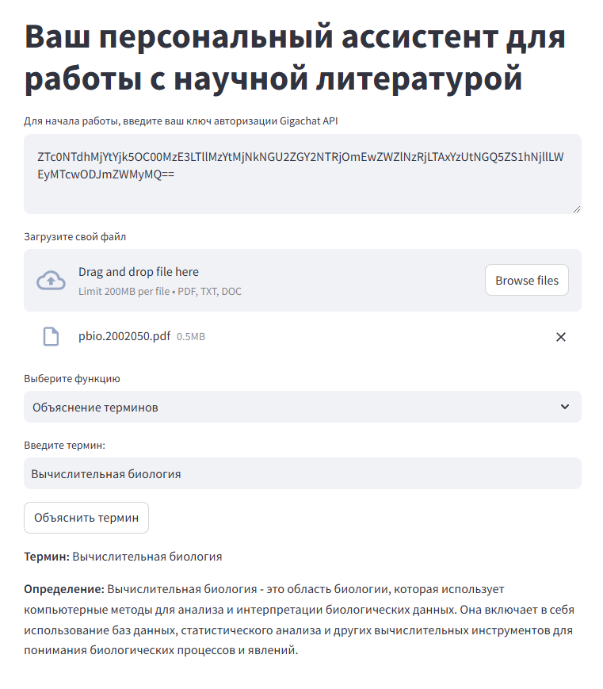
      
   #### 4) Адаптивная суммаризация
   Выберите процент суммаризации, затем нажмите кнопку "Суммировать" и вам выдастся сжатая на n(от 10 до 90) процентов.
   
   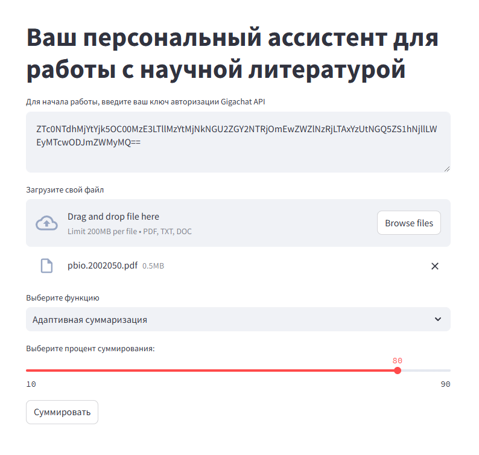
   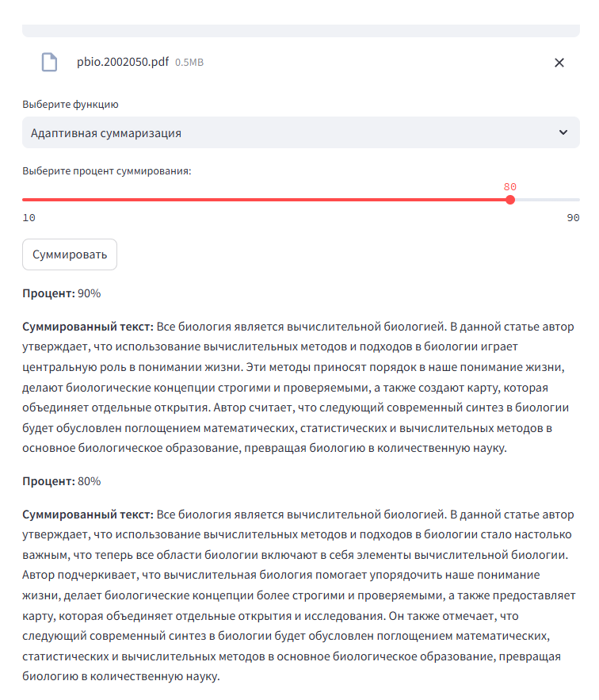

### 5. Сохранение контекста и истории взаимодействия.
При переходе с одной функции на другую, история взаимодействия и контекст сохраняется. Если снова перейти к той же функции, история чата вопсроизводится и можно продолжать работу с последнего запроса.
      
### Участие
Вклады — это то, что делает сообщество с открытым исходным кодом таким замечательным местом для обучения, вдохновения и творчества. Любой ваш вклад будет высоко оценен .

Если у вас есть предложение, которое сделает это лучше, пожалуйста, разветвите репозиторий и создайте запрос на извлечение. Вы также можете просто открыть проблему с тегом "улучшение". Не забудьте поставить проекту звезду! Спасибо еще раз!
## Контакты

Аптуков Вадим - [Аккаунт в телеграме](@HackNet11) - vraptukov@gmail.com

Ссылка на проект: [https://github.com/Aptukov/Scientific_literature_assistant](https://github.com/Aptukov/Scientific_literature_assistant)
